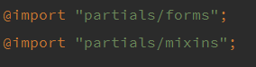
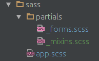

# Sass Basic Usage

#### Underscor: _partials
The underscore lets Sass know that the file is only a partial file and that it should 

not be generated into a CSS file. Sass partials are used with the @import directive.

When importing you don't need to include the underscore.

Examples:

---
# Links
[Verticle Alignment](http://codepen.io/hced/pen/FbdqC/)

